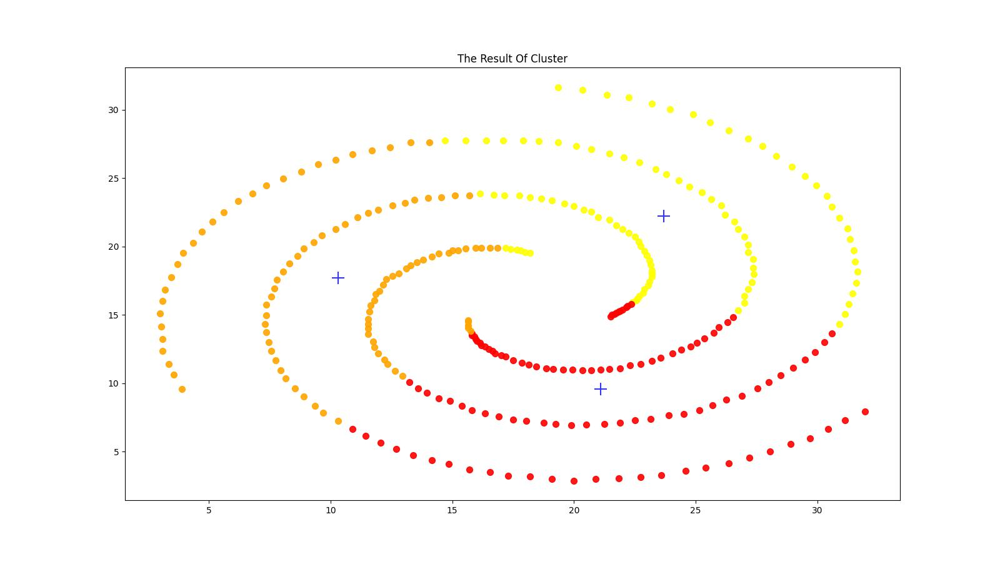
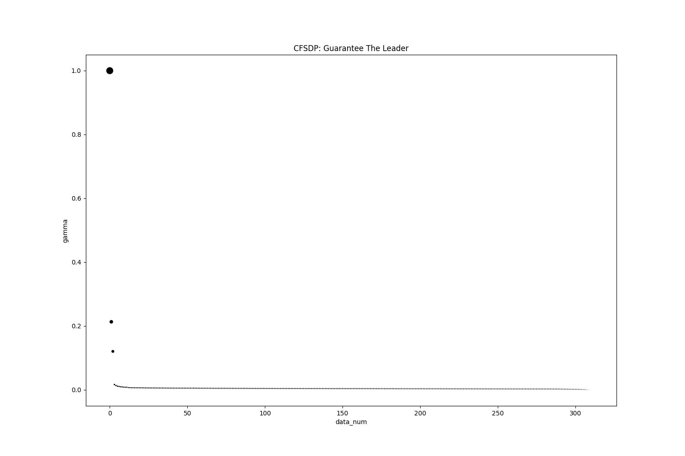

## Reference

### https://github.com/yl-jiang/Clustering-Python/tree/master
### other：https://github.com/lanbing510/DensityPeakCluster

---

## Requirements

- [NumPy](http://www.numpy.org): normal computing
- [Matplotlib](http://matplotlib.sourceforge.net/): For plotting data to choose threshold
- [Scikit-Learn](https://github.com/scikit-learn/scikit-learn): use for mds to plot result

---

## How to use

配置好环境，在./clister/xxx.py中修改数据集名称及路径，使用IDE/命令行运行即可，输出结果保存在./result中。

---

## Results

### K-means
spiral

</img>

flame

</img>

jain

</img>

### K-means++
spiral

</img>

flame

</img>

jain

</img>

### K-medoids
spiral

</img>

flame

</img>

jain

</img>

### DBSCAN
spiral

</img>

flame

</img>

jain

</img>

### CFSDP
spiral

</img>
</img>
</img>

aggregation

</img>
</img>
</img>

flame

</img>
</img>
</img>

jain

</img>
</img>
</img>

---

## Requirements

The MIT License (MIT)